# CR-6 SE Y-axis Linear rail and MGN12H carriage mount

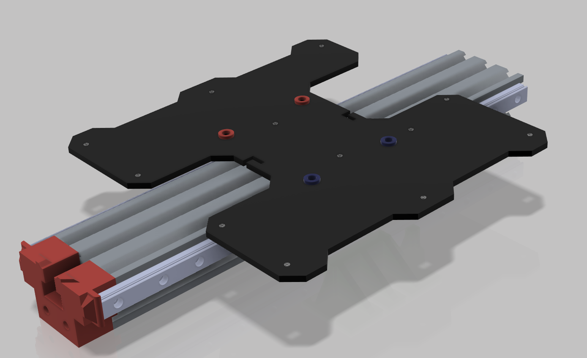

THIS PROJECT IS UNDER DEVELOPMENT

This conversion method DOES require you to replace the Y-axis belt, but unlike some other projects doesn't require you to cut the rail.

Required Supplies:
- 2x 350mm long MGN rail with MGN12H carriage.  [I bought this](https://smile.amazon.com/gp/product/B07SPQZ383/) because it was cheap and fast, I would recommend Hiwin.
- [GT2 timing belt](https://smile.amazon.com/gp/product/B07ZNNR238/) (this solution requires longer belt. will have to crimp yourself as well).
- 2x M5x30 mm button head or socket head screws (attach spacer to tensioner)
- 4x M5x10 mm button head or socket head screws (attach build plate carriage to brackets)
- 4x M5 nut or nylock nut (I used nylock nut, press into left and right brackets with pliers)
- 20x M3x8mm button head or socket head screws (attach rails to extrusion & bracket to tensioner)
- (optional) M3 nuts (for slide-in t-nuts if you choose to print your own, see notes.  Press in with pliers)
- (optional) [Alignment blocks for linear rail to 2020 extrusion](https://www.thingiverse.com/thing:2804412)

[Thingiverse Thing link](https://www.thingiverse.com/thing:4828178)

# Printed parts

## 'plate bracket left.stl'

This part mounts to the left side carriage and interfaces with the build plate carriage.  Need to press in M5 nuts or nylock nuts.

Suggested printing:
- 0.2mm layer
- 50% infill, Gyroid
- 4 walls
- Top touching build plate.  No supports.

## 'plate bracket right.stl'

This part mounts to the right side carriage and interfaces with the build plate carriage.  Need to press in M5 nuts or nylock nuts.  This part interfaces with the y-axis end stop/homing switch.

Suggested printing:
- 0.2mm layer
- 50% infill, Gyroid
- 4 walls
- Top touching build plate.  No supports.

## 'spacer_5mm.stl'

This part provides proper spacing to make sure the left side M5x10 screws do not bottom out on the linear rail when tightened to connect carriage to bracket

Suggested printing:
- 0.12mm layer
- 100% infill
- 4 walls (should be pretty much all walls...)
- No supports

## 'spacer_7mm.stl'

This part provides proper spacing to make sure the right side M5x10 screws do not bottom out on the linear rail when tightened to connect carriage to bracket.  In addition, since these holes are larger to accomodate the eccentric hex spacer on stock install.  This centers the screw to help remove slop.

Suggested printing:
- 0.12mm layer
- 100% infill
- 4 walls (should be pretty much all walls...)
- Top touching build plate.  No supports.

## Tensioner adapter

Since the linear rails are readily available in lengths of 300 and 350 mm, but 300mm is too short and 350 is too long; this adapter allows you to mount 350 mm rail without cutting the rail.  This part will also double as an end-stop for the front piecepart.

Suggested printing:
- 0.2mm layer
- 10-20% infill, Gyroid
- 3 walls
- Front side touching build plate.  Enable Supports (should just be the end stop sides that jut out, may not even be needed)

## OPTIONAL: 'rail nut m3-2x.stl'

See notes.  I used these to slide into extrusion.  I had to make them very thin to fit into the OpenBuilds extrusion I was experimenting with at my desk, turns out when I went to Creality extrusion, there are significantly different extrusion dimensions.  I ended up getting some plastic deformation when torquing down.  I'm buying metal T-nuts.

I prefer the double nut version over the single nut version below.  Your choice.

M3 nuts can be pressed in with pliers

Suggested printing:
- 0.12mm layer
- 100% infill
- 3 walls (should be pretty much all walls...)
- Top touching build plate.  No supports.

## OPTIONAL: 'rail nut m3-1x.stl'

See notes and text above in 'rail nut m3-2x.stl.

## OPTIONAL: 'vrail spacer m3.stl'

I used this to help keep the MGN rail out of the extrusion slot.  Probably not needed.

Suggested printing:
- 0.12mm layer
- 100% infill
- 3 walls 
- Top touching build plate.  No supports.

# Notes

- I used the printed t-nuts ('rail nut m3-2x.stl'), but found the plastic was pretty thin and gave under torque.  I'm ordering some metal slide in t-nuts from amazon ([This one](https://smile.amazon.com/gp/product/B075SY9Y96/) and [This one](https://smile.amazon.com/gp/product/B0841G5SB1/) to see how they fit.  I expect they will be more durable and secure.

# License

[Creative Commons - Attribution - Non-Commercial (CC BY-NC 3.0)](https://creativecommons.org/licenses/by-nc/3.0/)

# Changelog

2021/04/15 - Update readme instructions

2021/04/14 - Updated design files

2021/04/11 - Initial commit

## Design

Autocad Fusion 360 

## Slicer

Ultimaker Cura 4.8.0
- Printer: Creality CR6 SE
- Layer Height: 0.x mm
- Infill Density: xx%
- Infill Pattern: Gyroid
- Filament: Inland PLA+ 1.75mm Neon Green
- Material: PLA+
- Print Temperature: 215 degrees C

# Pics

# Model Views

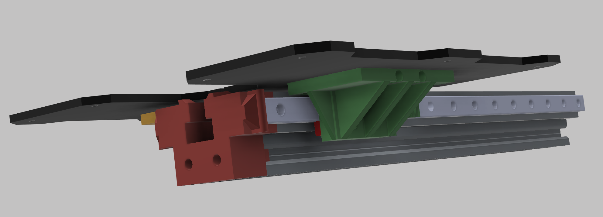
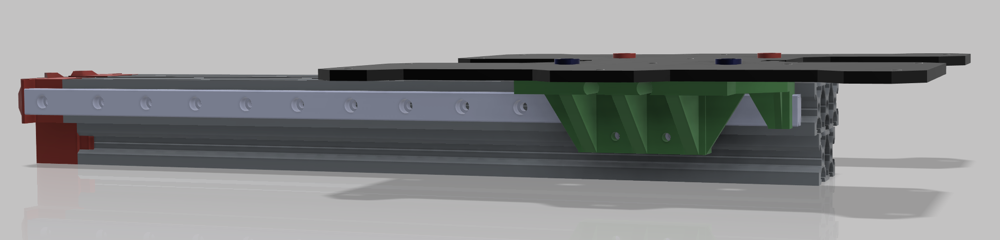
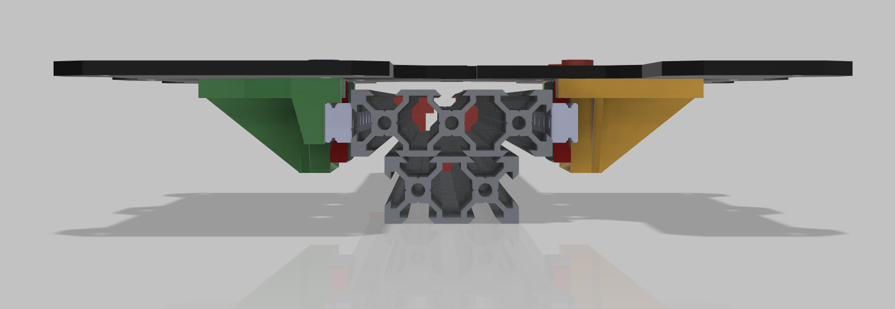

# T-nuts (optional)
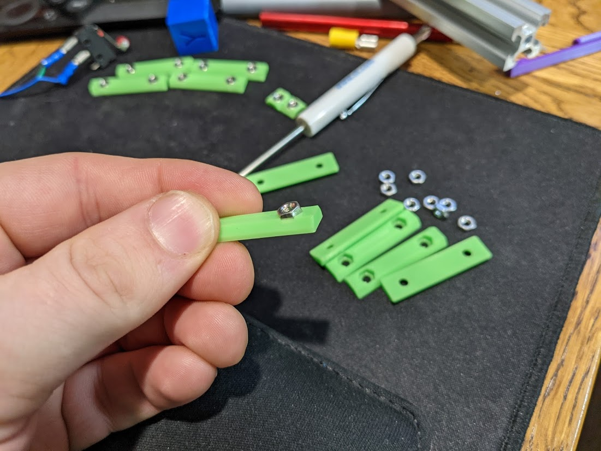
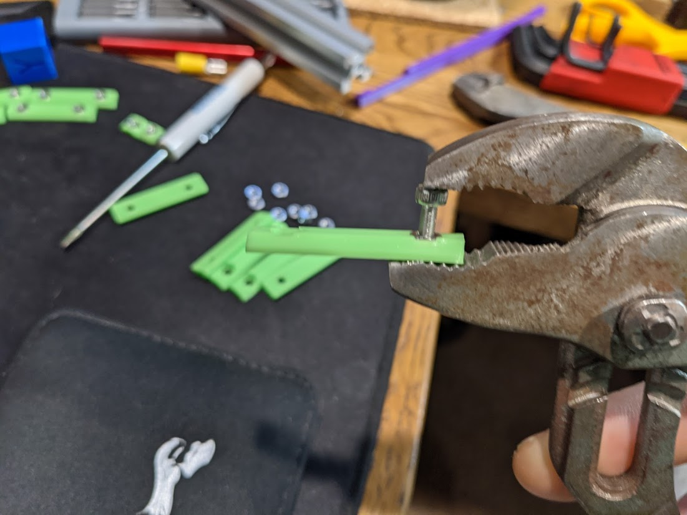
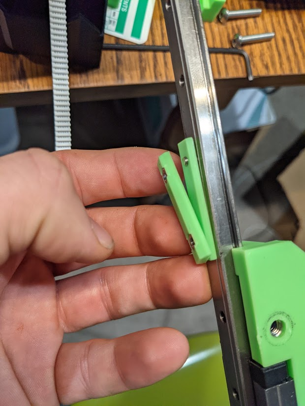 "T-nut and spacer")

# Adapter
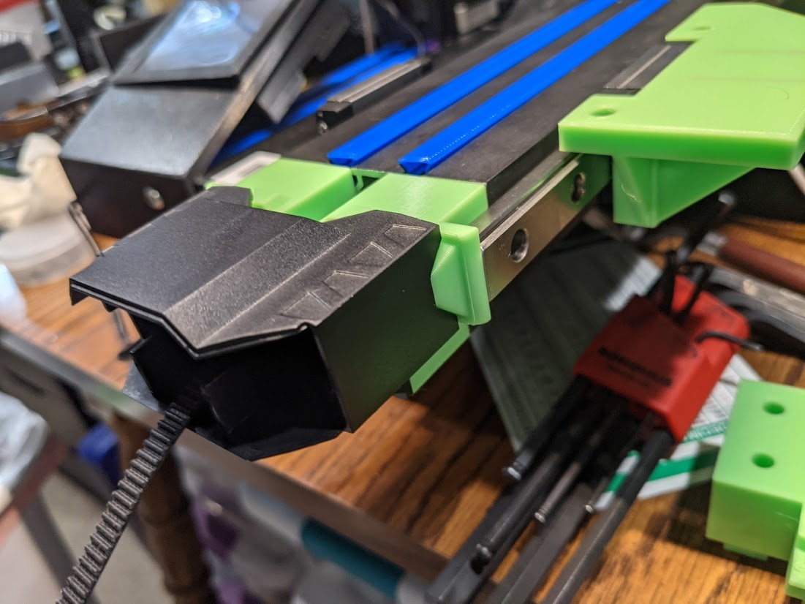
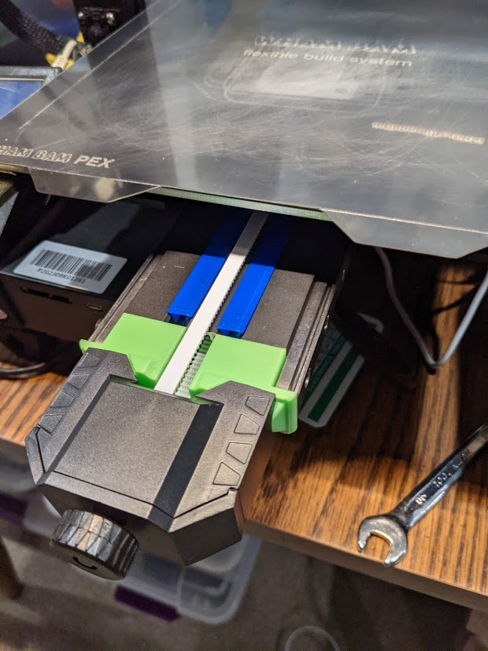

# Linear rail
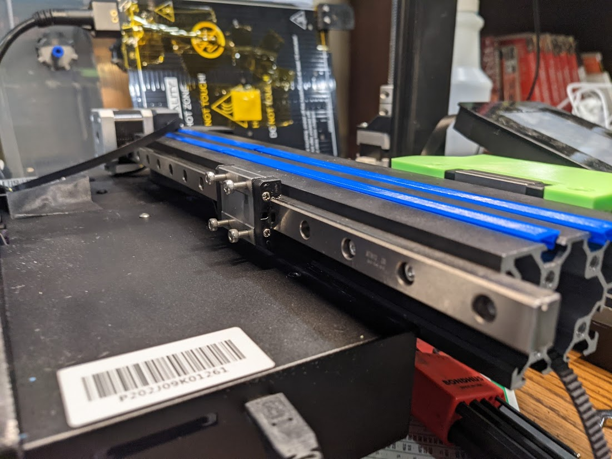
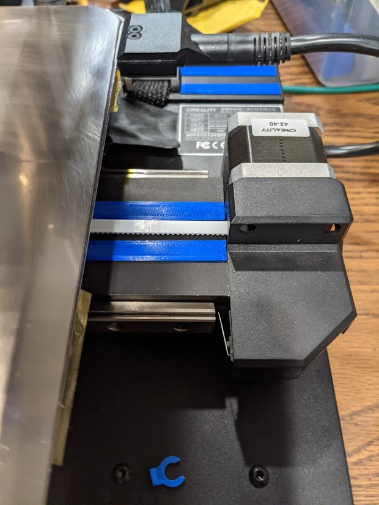
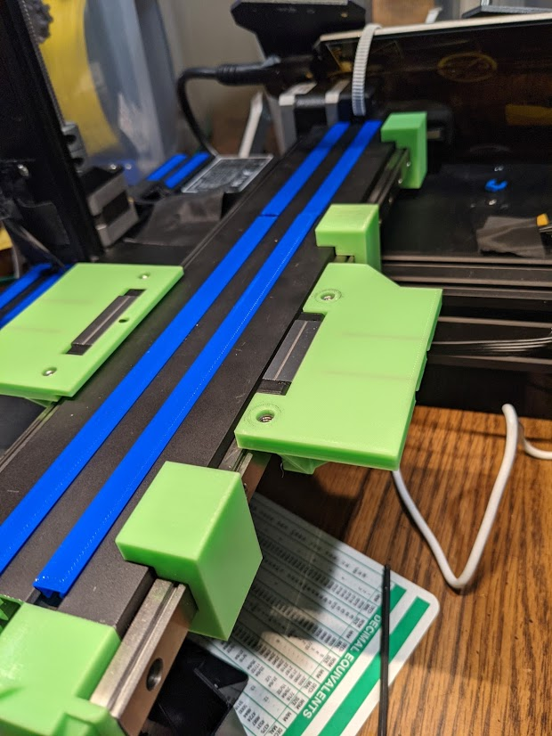

