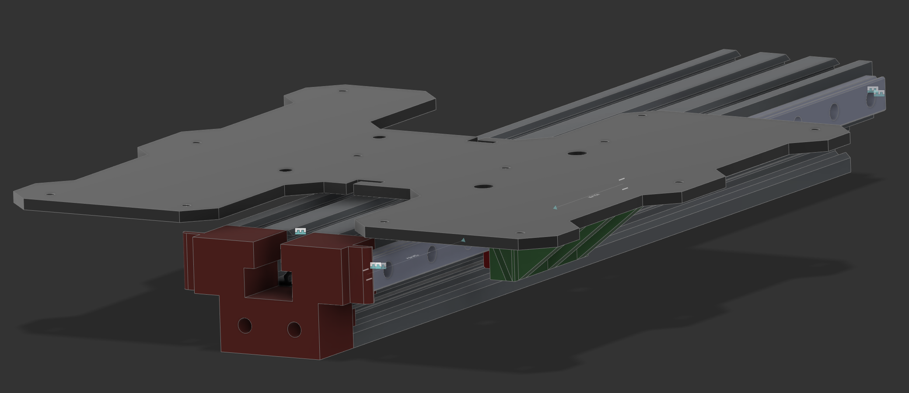

# CR-6 SE Y-axis Linear rail and MGN12H carriage mount

THIS PROJECT IS UNDER DEVELOPMENT

I purchase two of these rails w/ MGN12H carriages: https://smile.amazon.com/gp/product/B07SPQZ383

Front belt tensioner spacer is going to require an long M5 screw, probably 30-35mm.

# License

Creative Commons - Attribution - Non-Commercial

# Changelog

2021/01/24 - Add photos

## Design

Autocad Fusion 360 

## Slicer

Ultimaker Cura 4.8.0
- Printer: Creality CR6 SE
- Layer Height: 0.x mm
- Infill Density: xx%
- Infill Pattern: Gyroid
- Filament: Inland PLA+ 1.75mm Neon Green
- Material: PLA+
- Print Temperature: 215 degrees C

# Preview

